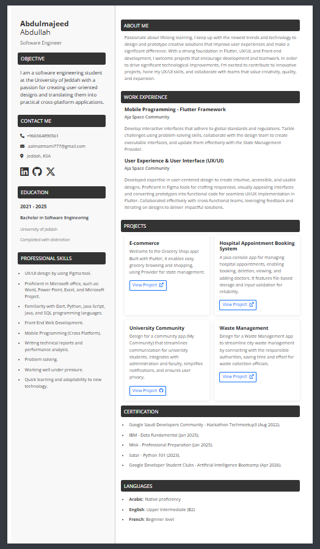
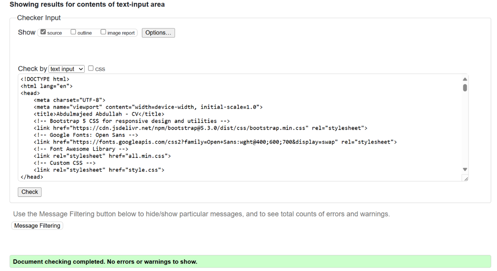

# Responsive CV/Resume Website

This project is a responsive online CV or resume built using HTML, CSS, and Bootstrap 5. It provides a clean and organized way to showcase your personal information, contact details, education, skills, work experience, projects, certifications, and languages.

## Features

* **Clean and Modern Design:** A visually appealing and easy-to-read layout.
* **Responsive Layout:** Adapts seamlessly to different screen sizes (desktop, tablet, mobile) using Bootstrap's responsive grid system and media queries.
* **Clear Sections:** Well-defined sections for Personal Info, Contact Me, Education, Professional Skills, Work Experience, Projects, Certification, and Languages.
* **Font Awesome Icons:** Uses Font Awesome for professional-looking icons for contact information and social media links.
* **Google Fonts:** Utilizes the "Open Sans" font for a readable and modern typography.
* **Bootstrap 5 Integration:** Leverages Bootstrap's grid, utility classes, and components (like cards for projects) for efficient styling and responsiveness.
* **Social Media Links:** Easily link to your LinkedIn, GitHub, and Twitter profiles.
* **Valid HTML:** The HTML structure is designed to be valid and semantic.

## Technologies Used

* **HTML5:** The structural foundation of the website.
* **CSS3:** Styling the layout and appearance.
* **Bootstrap 5:** A powerful CSS framework for responsive design and UI components.
* **Font Awesome:** An icon library for scalable vector icons.
* **Google Fonts:** A library of free and open-source fonts.

## Setup

To run this CV/Resume website locally:

1.  **Clone the repository:**
    ```bash
    git clone <https://github.com/abmj77/Personal-Resume.git>
    ```
2.  **Open `index.html` in your web browser.**

## Customization

You can easily customize this CV/Resume to showcase your own information:

* **`index.html`:**
    * Update the **Personal Info** section with your name, role, and objective.
    * Modify the **Contact Me** section with your phone number, email, location, and social media links.
    * Fill in your **Education** details, including dates, degrees, institutions, and any relevant details.
    * List your **Professional Skills**.
    * Add your **Work Experience** with job titles, companies, descriptions, and dates.
    * Populate the **Projects** section with your projects, descriptions, and relevant links.
    * Include your **Certifications**.
    * Specify your **Languages** and proficiency levels.
* **`style.css`:**
    * Customize the colors, fonts, and overall styling to match your preferences.

## Screenshots

_[**Note:** You would typically include actual screenshots of your CV website here on different screen sizes.]_

* **Desktop View:**
  
    

  
* **Mobile View:**
  
    

## Validation

The HTML code has been validated using the W3C Markup Validation Service.




## Contributing

Contributions to improve this template are welcome. Feel free to fork the repository and submit pull requests.

## Author

[Abdulmajeed Abdullah]
